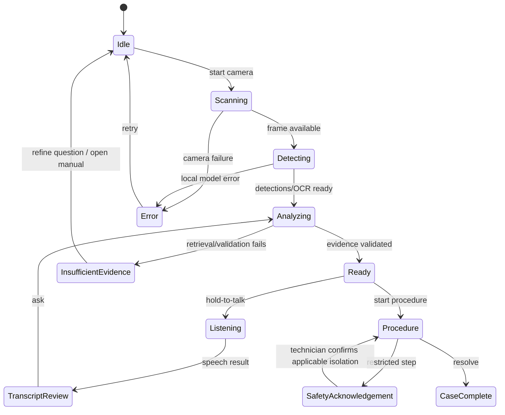

# LocalFix Architecture

This is the implementation plan for the focused ACM-4200 field-service MVP. Demo mode is an explicit, local simulation; it never reports demo timings as measurements or simulated inference as hardware capability.

## 1. Architecture diagram

```mermaid
flowchart LR
  UI[React field console] -->|localhost REST| API[FastAPI]
  UI --> Camera[Webcam / imported image]
  API --> Runtime[LocalInferenceEngine]
  Runtime --> Registry[ModelRegistry]
  Registry --> QNN[ONNX Runtime QNN EP]
  Registry --> CPU[ONNX Runtime CPU fallback]
  API --> Services[Vision · OCR · Speech · Retrieval · Reasoning]
  Services --> VLM[Multimodal VLM adapter]
  VLM --> GenieX[GenieX loopback API / QAIRT]
  Services --> Safety[Evidence validator + Safety Gate]
  Services --> DB[(SQLite + FTS5]
  Services --> Files[Controlled local data directory]
  API --> Cases[Cases + report renderer]
```

The browser is a presentation client. The backend owns local data, retrieval, inference adapter selection, safety validation, case persistence, and telemetry. All inference APIs bind to loopback by default. Qualcomm AI Hub Workbench is an optional model-development/profile service; its credential is never stored in the app and it is not an inference dependency.

## 2. Folder structure

```text
D:/LocalFix/
  frontend/                 Vite + React + strict TypeScript UI
  backend/                  FastAPI application, services, adapters, schemas
  data/manuals/              Fictional 16-page ACM-4200 source manual
  data/synthetic/images/     Original synthetic demo equipment artwork
  data/localfix.sqlite3      Created on first backend launch
  models/                    User-provided model files and manifest
  benchmark/                 Benchmark results and protocol
  docs/                      Product, safety, deployment, demo documentation
  tests/                     Backend unit and integration tests
  ARCHITECTURE.md            This design and contracts
```

## 3. Component tree

```text
App
├── AppShell
│   ├── Sidebar (Diagnose, Manuals, Cases, Reports, Settings)
│   ├── TopBar (offline, demo mode, runtime indicator)
│   └── RuntimeStrip (truthful backend telemetry)
├── OperationsHome /
├── LiveDiagnose
│   ├── CameraStage (webcam or clearly labeled synthetic feed)
│   ├── DetectionOverlay / CameraControls
│   ├── VoiceComposer / TranscriptReview
│   ├── DiagnosisPanel / ProcessingTimeline
│   └── EvidenceDrawer
├── EvidenceViewer (manual page + cited evidence inspector)
├── ProcedureTimeline (acknowledgement-gated safety steps)
├── CaseHistory (search, filters, details, save-as-knowledge)
└── ReportsRuntime (Report and Runtime tabs)
```

Shared state is a small typed reducer/context store. Motion is used for route transitions, camera target emphasis, evidence drawer, and procedure completion; motion is state-driven and respects reduced-motion preferences.

## 4. API contract

All request/response models are Pydantic. Errors use `{ "detail": { "code": "...", "message": "..." } }`.

| Method | Route | Contract / purpose |
|---|---|---|
| GET | `/health` | readiness, version, DB status |
| GET | `/runtime/status` | backend/provider/model states, RAM, network, measured recent timings, demo flag |
| POST | `/vision/detect` | image upload or local demo reference → detections and provenance |
| POST | `/vision/locate` | local VLM image-region estimate for a named component; invalid/ambiguous boxes become “not found” |
| POST | `/vision/ocr` | image upload or demo reference → normalized OCR values and boxes |
| POST | `/speech/transcribe` | local audio upload → transcript; returns explicit model-unavailable error when absent |
| POST | `/manuals/ingest` | PDF upload (bounded size/type) → document/page/chunk counts |
| POST | `/retrieve` | query + equipment model → ranked source-grounded evidence |
| POST | `/diagnose` | question, observation, evidence ids → validated diagnosis; insufficient source returns no-recommendation state |
| POST | `/procedure` | diagnosis/evidence ids → cited steps and safety classification |
| POST | `/cases` | case payload → persisted case |
| GET | `/cases` | searchable/paginatable local case list |
| GET | `/cases/{id}` | full case and timeline |
| POST | `/reports/generate` | case id + format (`pdf`, `markdown`, `json`) → local artifact metadata/content |
| POST | `/benchmark/run` | selected available local stages, repeats → measured statistics and caveats |
| GET | `/manuals` | local manual catalog |
| GET | `/manuals/{id}/pages/{page}` | extracted text and page metadata for evidence view |

Browser demo mode uses the same interface and data shapes, with a `simulated: true` marker. It does not call model endpoints or present simulated latency as measured performance.

## 5. Database schema

SQLite uses foreign keys, page-linked chunks, FTS5, and optional float32 local embedding blobs tagged with their model name. When the local encoder is ready, FTS and cosine-similarity results are combined with weighted reciprocal-rank fusion; FTS-only mode remains available.

```sql
documents(document_id TEXT PRIMARY KEY, document_name TEXT, source_hash TEXT,
          equipment_model TEXT, page_count INTEGER, ingested_at TEXT);
manual_chunks(chunk_id TEXT PRIMARY KEY, document_id TEXT REFERENCES documents,
              page INTEGER NOT NULL, section TEXT, equipment_model TEXT,
              text TEXT NOT NULL, embedding BLOB, embedding_model TEXT, source_hash TEXT);
manual_chunks_fts USING fts5(chunk_id UNINDEXED, document_id UNINDEXED,
              equipment_model UNINDEXED, section UNINDEXED, text,
              tokenize='unicode61');
cases(case_id TEXT PRIMARY KEY, equipment_model TEXT, serial_number TEXT,
      fault_code TEXT, diagnosis TEXT, status TEXT, technician TEXT,
      notes TEXT, resolution TEXT, created_at TEXT, updated_at TEXT,
      simulated INTEGER DEFAULT 0);
case_evidence(case_id TEXT REFERENCES cases, evidence_id TEXT,
      document_id TEXT, page INTEGER, section TEXT, text TEXT, score REAL,
      PRIMARY KEY(case_id, evidence_id));
case_steps(case_id TEXT REFERENCES cases, step_index INTEGER,
      action TEXT, reason TEXT, safety_level TEXT, completed INTEGER,
      source_document_id TEXT, source_page INTEGER, PRIMARY KEY(case_id, step_index));
```

Source page numbers are assigned during extraction and remain attached to every chunk, evidence, step, and citation. Hashes identify source content and support deduplicated ingestion.

## 6. Screen-by-screen wireframes

1. **Operations Home `/`** — fixed narrow navigation rail; large “Start diagnosis” action; ACM-4200 attention card; recent case row; compact runtime and privacy panel. Header carries OFFLINE and DEMO/LOCAL badges.
2. **Live Diagnose `/diagnose`** — 70/30 split; 16:10 equipment stage with camera controls and overlay labels; bottom voice composer; right diagnosis/evidence/timeline panel; evidence drawer enters from the right. Synthetic feed is labeled.
3. **Evidence `/evidence`** — page-preserving manual viewer left, citation/highlight inspector right, source coverage and retrieval relevance (never uncalibrated “AI confidence”).
4. **Procedure `/procedure`** — vertical cited step timeline; safety acknowledgement is a blocking state before restricted steps; camera “Show Me” brings the target overlay into focus.
5. **Cases `/cases`** — searchable local case list with status, asset, fault, evidence count; selecting a row shows observation, procedure, notes, resolution, photos, and source references.
6. **Reports `/reports`** — Report and Runtime tabs. Report preview/export controls; Runtime shows detected provider, model registry, memory/network, measured timings, benchmark/reload/cache/diagnostics actions.

All six routes share the same app shell and visual tokens. Sidebar items route to these six primary surfaces; Settings opens the Runtime tab.

## 7. State machine



Safety acknowledgement is scoped to the current case/procedure and is never inferred from an LLM response. Model-unavailable errors do not fall back to invented answers.

## 8. Inference pipeline

Camera/audio input → explicit demo or actual local adapter route → OCR/detector and local ASR → observed-context query → equipment-filtered FTS5 plus optional FastEmbed similarity → weighted reciprocal-rank fusion → loopback-only Qwen3-VL generation when installed → cited-evidence/source-language validator → fixed source-backed procedure map → safety acknowledgement gate → UI. A separate local VLM image-region estimate supports “Show Me”; the UI labels it as an uncalibrated estimate and drops malformed boxes. VLM output cannot create procedure steps. No raw media is logged or persisted by inference endpoints.

## 9. Deployment strategy

Development runs Vite and FastAPI as separate local processes. The current AMD64 profile runs RapidOCR PP-OCRv6, faster-whisper tiny.en, BGE-small embeddings, and Qwen3-VL 2B Instruct locally; OCR/ASR/retrieval are CPU-backed and the Ollama VLM accelerator is not reported as QNN. A YOLOv8 task decoder exists but has no detector weights. The build host has not validated NPU execution on the HP Snapdragon. QNN is reported active only when a configured ONNX Runtime session reports the provider. The optional Windows ARM64 profile adds a GenieX OpenAI-compatible loopback adapter and a launcher configured for Qualcomm AI Engine Direct/NPU. GenieX's server currently does not expose accelerator telemetry to LocalFix, so its NPU status remains unverified even after the first response; compare and benchmark on the physical target before making a hardware claim.

## 10. Benchmark strategy

The benchmark runs ten real serial task operations for available local OCR, ASR (with selected audio), vision (with selected image and configured detector), and retrieval stages. It reports raw samples and mean/median/p95/min/max, with model/provider, adapter load and warmup telemetry, RAM, and network-request count. A deterministic synthetic label supports OCR latency checks only and is not an accuracy claim. Generic zero-tensor ONNX smoke runs remain ineligible for performance claims. GenieX VLM timing is measured as an end-to-end loopback response; the app does not infer NPU placement from the model name or target profile. The Windows AMD64 build host cannot make Snapdragon NPU-versus-CPU claims; compare equivalent models and inputs on the target only.
